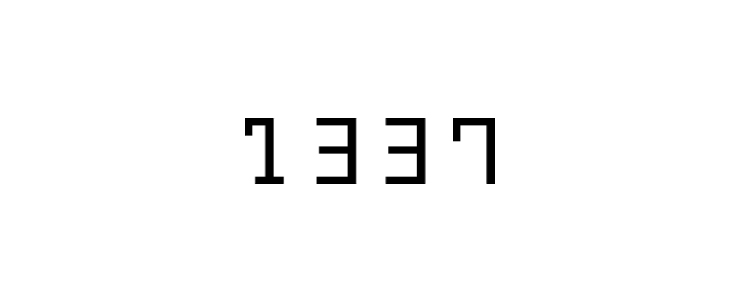

<!--  -->
  

#  **1337 Projects**

All the projects that I worked on at 1337 (42 network) computer science school.

##  C-Projects :

<ul>
	<li><a href="./Libft">Libft</a>.</li>
	<li><a href="./Get_next_line">Get next line</a>.</li>
	<li><a href="./ft_printf">ft_printf</a>.</li>
	<li><a href="./Cube3D/">Cube3D</a>.</li>
	<li><a href="./minishell">Minishell</a> Collab with<strong> <a href="https://github.com/moukasso">@Oukassou</a></strong>.</li>
	<li><a href="./minitalk">Minitalk</a></li>
	<li><a href="./Philosophers">Philosophers</a>.</li>
	<li><a href="./push_swap">Push swap</a>.</li>
</ul>

##  C++-Projects :

<ul>
	<li><a href="./CPP Module">CPP Module</a>.</li>
	<li><a href="./ft_containers">ft_containers</a>.</li>
</ul>

## Network & System administration :

<ul>
	<li><a href="./ft_server">ft_server</a>.</li>
	<li><a href="./Inception">Inception</a>.</li>
	<li><a href="./Webserver">Webserver</a> Collab with<strong> <a href="https://github.com/moukasso">@Oukassou</a></strong>.</li>
</ul>

## Web APP :

<ul>
	<li>
		<a href="./ft_transcendence">ft_transcendence</a> Collab with
		<strong><a href="https://github.com/moukasso">@Oukassou</a></strong>, 
		<strong><a href="https://github.com/mohammedmarzouki">@Mohammedmarzouki</a></strong> and
		<strong><a href="https://github.com/taoufiqjmari">@Taoufiqjmari</a></strong>.
	</li>
</ul>

## Holy Graph :

<strong style="background-color: #62b5a0; color: #fff; font-size: bold;">GREEN CIRCLE = Validated Project</strong> 
<strong style="background-color: #2b2b2b; color: #fff; font-size: bold;">GRAY CIRCLE  = Not Validated Project</strong>

